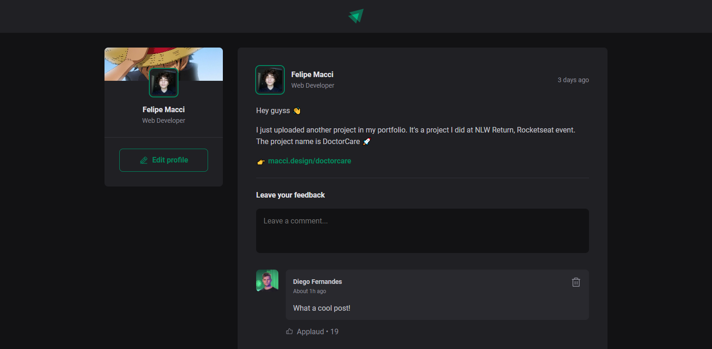

<h1 align="center">IGNITE FEED 📭</h1>
<h3 align="center">ROCKETSEAT IGNITE REACTJS: PROJECT 1 FILES</h3>

 

    

 

#### RELEASE NOTES: V1.0.0:
- First version of the project 🎉
- See if the weather won't spoil your weekend party!
- Current information of your city and others
- Forecast options: "today" and "tomorrow"

 

#### TECHNOLOGIES:
- HTML 📄
- CSS 🎨
- TypeScript 💻
- ReactJS ⚛
- NodeJS 🐱‍👤

 

#### HOW TO USE:
* First have NodeJS on your machine
* With the project folder already open in VS CODE (or similar) type the commands in the sequence: "npm install" and "npm run dev"
* Then open the domain that appeared in your console
* Finally, use and enjoy the Ignite Feed!

 

Felipe Macci
